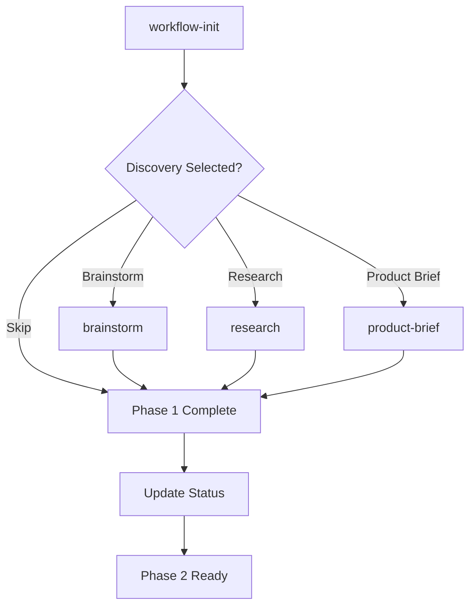

# Phase 1 Orchestrator

The Phase 1 Orchestrator provides an orchestrated, autonomous execution layer for BMAD v6
without redefining the method itself. It enables Phase 1 (Analysis) to be executable,
autonomous, and reliable while faithfully preserving BMAD v6 semantics.

## Overview

The orchestrator sits on top of existing BMAD v6 workflows, providing:

- **Stateful execution** - Progress tracked in artifacts, not chat history
- **Deterministic behavior** - All execution derived from workflow assets
- **Bounded autonomy** - Autonomous loops with explicit limits
- **Artifact propagation** - Contract-based handoff to Phase 2

:::note[Important: Contracts, Not Engine]
The orchestrator files provide **configuration and rules** for execution, not a ready-made
execution engine. You need an LLM orchestrator (or interactive agent) to read and execute
these configurations. See [How to Run Orchestrated Phase 1](../../how-to/workflows/run-orchestrated-phase1.md).
:::

## Mandatory vs Optional Components

:::note[Path Conventions]
Paths in this document use the **installed project layout** (`_bmad/`).
For repository source paths, replace `_bmad/` with `src/` (e.g., `src/core/orchestrator/...`).
:::

### Mandatory for Faithful Phase 1 Orchestration

These components are **required** for proper orchestrated execution:

| Component            | Installed Path                                           | Purpose                                 |
| -------------------- | -------------------------------------------------------- | --------------------------------------- |
| Workflow Init        | `_bmad/bmm/workflows/workflow-status/init/workflow.yaml` | Canonical gate and status file creation |
| Phase 1 Workflows    | `_bmad/bmm/workflows/1-analysis/*`                       | Actual research/product-brief content   |
| Phase 1 Orchestrator | `_bmad/core/orchestrator/phase1-orchestrator.yaml`       | Main orchestration manifest             |
| Status Resolver      | `_bmad/core/orchestrator/status-resolver.yaml`           | Multi-format status file support        |
| Artifact Registry    | `_bmad/core/orchestrator/artifact-registry.yaml`         | Artifact registration rules             |
| Checklist Evaluator  | `_bmad/core/orchestrator/checklist-evaluator.yaml`       | Hard gate validation                    |
| Router Dispatcher    | `_bmad/core/orchestrator/router-dispatcher.yaml`         | Sub-workflow routing                    |
| Instructions         | `_bmad/core/orchestrator/instructions.md`                | LLM integration rules                   |

### Optional Components (Autopilot Mode Only)

These are only needed if you enable autonomous brainstorm execution:

| Component            | Installed Path                                            | Purpose                           |
| -------------------- | --------------------------------------------------------- | --------------------------------- |
| Brainstorm Autopilot | `_bmad/core/orchestrator/brainstorm-autopilot.yaml`       | Multi-agent brainstorm automation |
| Loop Controller      | `_bmad/core/orchestrator/autonomous-loop-controller.yaml` | Bounds and stop conditions        |

### Not Required for Execution

Documentation files in `docs/reference/workflows/*` are informational only and not runtime dependencies.

## Core Principles

### 1. BMAD Is the Source of Truth

The orchestrator derives all behavior from on-disk workflow assets:

- `workflow.yaml` files define workflows
- Router assets define sub-agent selection
- Templates define artifact structure
- Checklists define completion gates

If an asset is missing, it's an error—not an opportunity to improvise.

### 2. Orchestration Is Structural

Phase 1 executes as a stateful workflow:

- Progress stored in artifacts
- Decisions persisted to status files
- Model-to-model interaction treated as execution logic
- No reliance on chat history

### 3. Checklists Are Hard Gates

Every declared checklist must exist and be evaluated:

- Required items block completion on failure
- "Looks good" is never sufficient
- Objective, verifiable criteria required

### 4. Autonomy Is Bounded

All autonomous loops have explicit limits:

- `max_depth` - Maximum nesting depth
- `max_iterations` - Maximum loop iterations
- `stop_conditions` - Explicit termination criteria
- Incompleteness recorded, not hidden

## Components

### Phase 1 Orchestrator

Main orchestrator configuration defining:

- Workflow steps and sequencing
- Router configurations
- Checklist definitions
- Autonomy controls

**Location:** `src/core/orchestrator/phase1-orchestrator.yaml`

### Status Resolver

Implements workflow status as an abstraction:

- Supports `.yaml` and `.md` formats
- Searches multiple locations
- Provides unified read/write interface

**Location:** `src/core/orchestrator/status-resolver.yaml`

### Artifact Registry

Manages artifact registration and propagation:

- Validates artifacts before registration
- Tracks phase attribution and confidence
- Ensures Phase 2 can load without heuristics

**Location:** `src/core/orchestrator/artifact-registry.yaml`

### Checklist Evaluator

Evaluates checklists as hard gates:

- Expression-based criteria evaluation
- Failure handling (block/mark_for_review/warn)
- Objective validation only

**Location:** `src/core/orchestrator/checklist-evaluator.yaml`

### Router Dispatcher

Routes to sub-workflows via assets:

- Selection-based routing
- Condition-based routing
- Track gating (e.g., Enterprise only)

**Location:** `src/core/orchestrator/router-dispatcher.yaml`

### Autonomous Loop Controller

Controls bounded autonomous execution:

- Iteration and depth limits
- Stop condition evaluation
- Incompleteness recording

**Location:** `src/core/orchestrator/autonomous-loop-controller.yaml`

### Brainstorm Autopilot

Multi-agent brainstorm automation:

- Analyst agent (convergence)
- Explorer agent (divergence)
- Artifact-driven completion

**Location:** `src/core/orchestrator/brainstorm-autopilot.yaml`

## Execution Modes

### Interactive Mode (Default)

Standard user-driven execution:

1. Present workflow step
2. Wait for user input
3. Execute and update status
4. Proceed to next step

### Autopilot Mode

Autonomous execution for brainstorm only:

1. Enable with `autopilot=true`
2. Analyst and Explorer agents alternate
3. Intermediate artifacts captured
4. Terminate on completion criteria or limits

## Phase 1 Workflow



### Step 1: Workflow Init (Required)

Determines track, field type, and discovery selections.

### Step 2: Brainstorm (Optional)

Creative exploration with optional autopilot mode.

**Completion Criteria:**

- Project brief exists
- Assumptions documented
- Research plan defined
- Open questions bounded (≤10)

### Step 3: Research (Optional)

Routed research (market/domain/technical).

**Note:** Technical research requires Enterprise track.

### Step 4: Product Brief (Optional)

Structured product brief creation.

## Status Abstraction

The workflow status supports multiple formats and locations:

### Supported Formats

| Format   | Extension | Parser      |
| -------- | --------- | ----------- |
| YAML     | `.yaml`   | yaml        |
| Markdown | `.md`     | frontmatter |

### Search Locations

1. `{planning_artifacts}/bmm-workflow-status.yaml`
2. `{planning_artifacts}/bmm-workflow-status.md`
3. `{project-root}/bmm-workflow-status.yaml`
4. `{project-root}/bmm-workflow-status.md`
5. `docs/bmm-workflow-status.yaml`
6. `docs/bmm-workflow-status.md`

### Extended Fields

The orchestrator adds optional fields for enhanced tracking:

```yaml
# Track and Discovery Selections (from workflow-init)
selected_track: 'method' # or 'enterprise'
field_type: 'greenfield' # or 'brownfield'
discovery_selections:
  brainstorm: true
  research: true
  product_brief: false

# Artifact Registry
artifacts:
  product-brief:
    path: 'docs/product-brief.md'
    phase: 1
    confidence: 'high'
    status: 'complete' # or 'draft', 'blocked'

# Phase Attribution
phase_attribution:
  product-brief: 1

# Confidence Levels
confidence:
  product-brief: 'high'

# Key Findings
key_findings:
  - finding: 'Target market is SMB'
    source_artifact: 'research-market'

# Open Questions
open_questions:
  - question: 'Pricing strategy?'
    blocking: false
```

## Artifact Propagation

Every artifact must be registered to exist for Phase 2:

1. **Create artifact** on disk
2. **Validate** against criteria
3. **Register** in workflow-status
4. **Propagate** to downstream phases

Unregistered artifacts are invisible to Phase 2.

## Compatibility

### Path Aliases

| Primary                | Alias                                |
| ---------------------- | ------------------------------------ |
| `_bmad/`               | `.bmad/`                             |
| `{planning_artifacts}` | `{output_folder}/planning-artifacts` |

### Backward Compatibility

- Works with existing BMM status files
- Extended fields are optional
- Downgrades gracefully for basic tools

## Replaceable Design

The orchestrator can be removed without breaking:

- Workflow assets (unchanged)
- Produced artifacts (standard format)
- Phase 2 behavior (status file contract)

**Test:** If removing the orchestrator breaks BMAD semantics, the design is wrong.

## Execution Quick Reference

### As a BMAD User (Interactive Mode)

```bash
# 1. Install BMAD v6
npx bmad-method@alpha install

# 2. In IDE/agent chat, run workflow-init
*workflow-init

# 3. Execute selected Phase 1 workflows interactively
*brainstorm   # if selected
*research     # if selected
*product-brief # if selected
```

### As an LLM Orchestrator

```yaml
# Pseudo-algorithm for orchestrated execution
1. Verify _bmad/... installation exists
2. Execute workflow-init (workflow, not heuristic)
3. Read bmm-workflow-status.* via status-resolver.yaml rules
4. Load phase1-orchestrator.yaml
5. For each step allowed by status/track:
   - Execute workflow at declared path
   - If autopilot=true for brainstorm:
     - Load brainstorm-autopilot.yaml
     - Load autonomous-loop-controller.yaml
6. After each artifact:
   - Validate via artifact-registry.yaml + checklist-evaluator.yaml
   - Register in status (artifact propagation)
7. Complete Phase 1: status readable by Phase 2 without heuristics
```

## Related Documentation

- [How to Run Orchestrated Phase 1](../../how-to/workflows/run-orchestrated-phase1.md)
- [Core Workflows](./core-workflows.md)
- [Global Configuration](../configuration/global-config.md)
- [Agents Reference](../agents/index.md)
